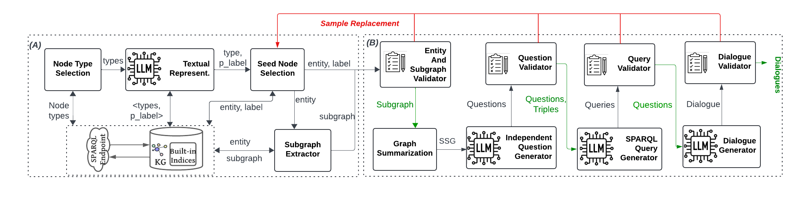

This repository is dedicated to our paper titled "Dialogue Benchmark Generation from Knowledge Graphs with Cost-Effective Retrieval-Augmented LLMs" published in SIGMOD 2025. The full paper can be accessed [here](https://dl.acm.org/doi/abs/10.1145/3709681).

## Table of Contents

1. [Abstract](#Abstract)
2. [System Requirements](#system-requirements)
3. [Installation](#installation)
4. [Run Experiments](#run-experiments)
5. [Contact](#contact)

## Abstract
Dialogue benchmarks are crucial in training and evaluating chatbots engaging in domain-specific conversations. Knowledge graphs (KGs) represent semantically rich and well-organized data spanning various domains, such as DBLP, DBpedia, and YAGO. Traditionally, dialogue benchmarks have been manually created from documents, neglecting the potential of KGs in automating this process. Some question-answering benchmarks are automatically generated using extensive preprocessing from KGs, but they do not support dialogue generation. This paper introduces Chatty-Gen, a novel multi-stage retrieval-augmented generation platform for automatically generating high-quality dialogue benchmarks tailored to a specific domain using a KG. Chatty-Gen decomposes the generation process into manageable stages and uses assertion rules for automatic validation between stages. Our approach enables control over intermediate results to prevent time-consuming restarts due to hallucinations. It also reduces reliance on costly and more powerful commercial LLMs. Chatty-Gen eliminates upfront processing of the entire KG using efficient query-based retrieval to find representative subgraphs based on the dialogue context. Our experiments with several real and large KGs demonstrate that Chatty-Gen significantly outperforms state-of-the-art systems and ensures consistent model and system performance across multiple LLMs of diverse capabilities, such as GPT-4o, Gemini 1.5, Llama 3, and Mistral.


## System Requirements
The system requirements needed to run the codebase.

- Operating System: [e.g., Ubuntu 20.04, macOS, Windows 10]
- Python Version: [e.g., 3.8+]
- Optional Software: [e.g., Docker, Docker Compose]

## Installation 

### (without docker)
1. git clone the repo
2. `cd repo-directory`
3. `python3 -m venv .venv` create new python virtual environment
4. `sudo apt install python3-pip` make sure pip is installed
    `python3 -m pip install --upgrade pip`
5. `source .venv/bin/activate` - activate virtual environment
6. `pip3 install -r requirements.txt`

### (with docker)
1. make sure you have docker installed `docker --version`, install it if not found - [docker installation guide](https://docs.docker.com/engine/install/)
2. git clone the repo
3. `cd repo-directory`
4. `docker compose up --build`

## Run Experiments
To run the experiments you need to first configure the run-config yaml file

- example runconfig.yaml looks like below.
```yaml
kghost: 206.12.95.86 # knowledge graph sparql endpoint
kgport: 8894
redishost: localhost
outputdir: ./results/docker-test/dblp/singleshot/gpt-3.5-turbo # output directory path for generated benchmark data
kgname: dblp # the knowledge graph name
pipeline_type: original
dataset_size: 1
dialogue_size: 5
wandb_project: cov-kg-benchmark
approach: 
  - single-shot
  - subgraph-summarized
comman_model:
  model_type: "openai"
  model_name: "gpt-3.5-turbo"
  model_endpoint: ""
  model_apikey: "<OPENAI_API_KEY>"
use_label: true
tracing: true
logging: true
```

- update `benchmark/appconfig.py` with location of your runconfig.yaml file

### Run experiments without docker
- activate virtual environment `source .venv/bin/activate`
- install dependecies `pip install -r requirements.txt`
- make sure you have updated the `runconfig-yaml` and its path in `benchmark/appconfig.py`
- run `python3 benchmark/main.py`, will store the generated data at outputdir path in runconfig-yaml

### Run experiments with docker
- make sure you have updated the `runconfig-yaml` and its path in `benchmark/appconfig.py`
- run `docker compose up --build`

Citing Our Work
-
- - - -
```
@article{chattygen,
author = {Reham Omar, Omij Mangukiya, and Essam Mansour },
title = {Dialogue Benchmark Generation from Knowledge Graphs with Cost-Effective Retrieval-Augmented LLMs},
year = {2025},
doi = {10.1145/3709681},
journal = {Proceedings ACM Management Data(SIGMOD)},
}
```
Contact:
-
- - - -
For any queries, feel free to send an e-mail to `reham.omar@mail.concordia.ca` or `essam.mansour@concordia.ca`. We look forward to receiving your feedback.
